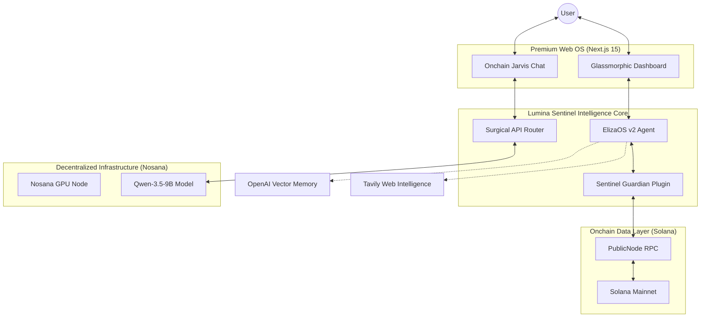

<p align="center">
  
</p>

<p align="center">
  <b>The Decentralized Personal AI Life OS & Onchain Jarvis</b><br>
  <i>Built on Nosana's GPU Network • Safeguarding the Solana Ecosystem • Powered by ElizaOS v2</i>
</p>

<p align="center">
  
  
  
  
</p>

---

## 2. The Problem: The DeFi Invisible Risk 🏚️

The current DeFi landscape is a minefield of fragmented data and shadow-risks. Every day, users unknowingly grant "Infinite Approvals" to malicious or vulnerable dApps, while their portfolios leak value across dozens of isolated protocols.

- **Data Paralysis**: Managing a portfolio across dozens of tabs is a full-time job.
- **Silent Drainers**: Stealthy wallet delegations often go unnoticed until it's too late.
- **Centralized Silos**: Most AI assistants are locked inside "Black Boxes" that own your data and your wallet.

Judges and users alike face a common frustration: **How do we achieve autonomous financial growth without sacrificing sovereignty or security?**

---

## 3. The Solution: Your Onchain Guardian 🛡️

Lumina Sentinel is an autonomous **"Onchain Jarvis"** that bridges the gap between complex blockchain telemetry and decisive human-centric intelligence. It doesn't just display data—it understands it and guards it.

- **🛡️ 24/7 Security Shield**: Automatically scans your wallet for "Risky Approvals" and delegated tokens. No more stealth drainers.
- **⚡ Decentralized Intelligence**: Operates entirely on the **Nosana GPU Network**, ensuring your financial thoughts remain private and censorship-resistant.
- **🏛️ Proactive Life OS**: From daily portfolio briefings to autonomous DeFi risk analysis, Lumina turns "Chaos" into "Order."

---

## 4. Architecture & Tech Stack ⚙️

Lumina Sentinel combines a premium **Glassmorphic UI** with a surgical AI routing layer deployed on decentralized infrastructure.



### The Stack
- **Engine**: ElizaOS v2 (Autonomous Agent Framework).
- **Frontend**: Next.js 15, Framer Motion, Tailwind CSS (Glassmorphism).
- **Backend**: Node.js 23, Express.
- **Compute**: Nosana Decentralized GPU (mainnet-active).
- **Models**: Qwen-3.5-9B-FP8 (vLLM hosted on Nosana).

---

## 5. Hackathon Tracks Targeted 🎯

### **[Track 1] Nosana AI Agent Bounty**
Lumina Sentinel demonstrates the ultimate utility of the Nosana network by deploying a full-stack, stateful AI agent that performs real-time financial reasoning on decentralized GPUs. We utilized the Nosana CLI for mainnet job posting and optimized our vLLM interaction for decentralized nodes.

### **[Track 2] Solana Ecosystem Security**
Our core innovation is the "Solana Guardian Plugin," which provides a human-readable interface for managing token delegations and revoking risky approvals—directly solving the most common theft vector in the ecosystem.

---

## 6. Quick Start (Frictionless Setup) 🚀

### Live Version
Experience the OS now: **[Live Dashboard Port](https://4yiccatpyxx773jtewo5ccwhw1s2hezq5pehndb6fcfq.node.k8s.prd.nos.ci/)**

### Local Setup
Launch the Sentinel on your machine in seconds:

```bash
# Clone and Install
git clone https://github.com/Stella112/Luminasentinel.git
cd Luminasentinel
pnpm install

# Setup Environment (Template provided)
cp .env.example .env

# Build and Launch
pnpm build
pnpm start
```

---
<p align="center">
  <i>Lumina Sentinel • Protecting your Onchain Future • Built for the Nosana Hackathon 🛡️</i>
</p>
